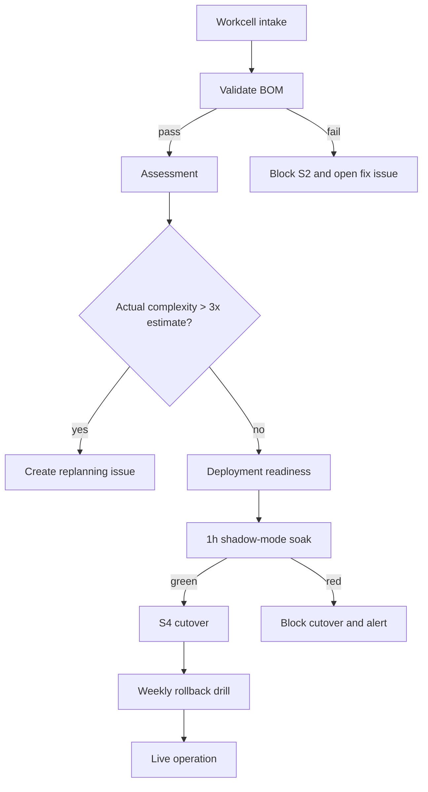

# Factory and S4 Foundation

## Context

This foundation defines the shared state, orchestration, and safety model for Workcell-style factory flows.

## Decisions

- `.factory-state.json` is the single source of truth for station state.
- The conductor dispatches work in waves, not unbounded parallel batches.
- BOM validation happens before S2 work starts.
- S4 cutover requires shadow-mode soak plus rollback rehearsal.
- Takt time is measured continuously so bottlenecks are visible.

## State Model

| Station | Purpose | Exit Gate |
|---|---|---|
| S1 | Intake and normalization | BOM valid, ownership known |
| S2 | Assessment and sizing | Complexity within estimate, replanning closed |
| S3 | Deployment readiness | Dependencies ready, gates green |
| S4 | Shadow-mode cutover | Shadow soak passes and rollback is rehearsed |
| S5 | Live operation | Metrics stable, dwell time tracked |

## Decision Tree

## Runbook

1. Curator publishes the current `.factory-state.json`.
2. Conductor reads the state file and routes only the next ready wave.
3. BOM validator blocks S2 if the intake is incomplete or invalid.
4. S4 validator compares shadow and live results on error rate, latency, and divergence.
5. Rollback testing runs on schedule and records whether the old path is still recoverable.

## Metrics

- **Takt time** = dwell time at each station from entered to exited timestamps.
- Report median and p95 by station.
- Flag any item that exceeds its station SLA.
- Export the tracker output as JSON for dashboards and alerts.
