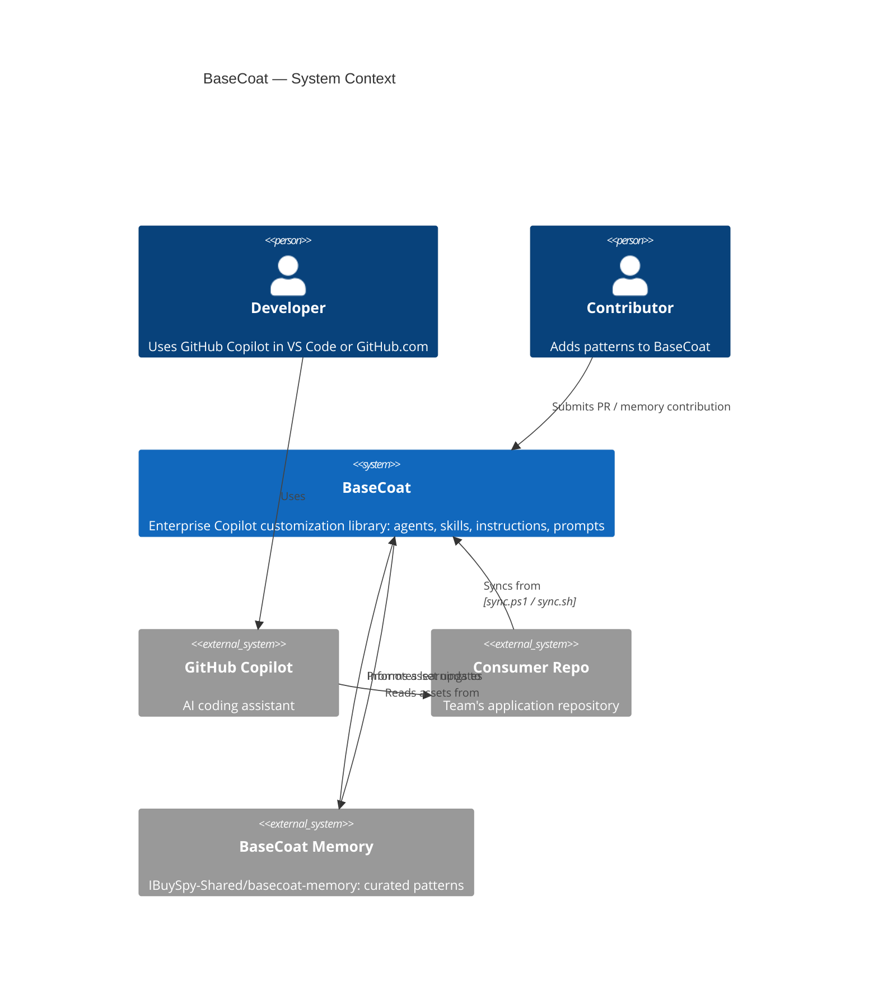
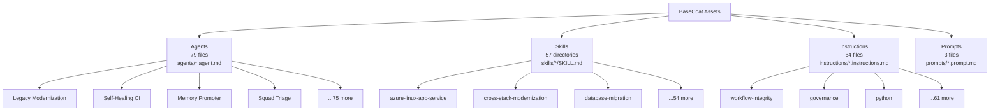
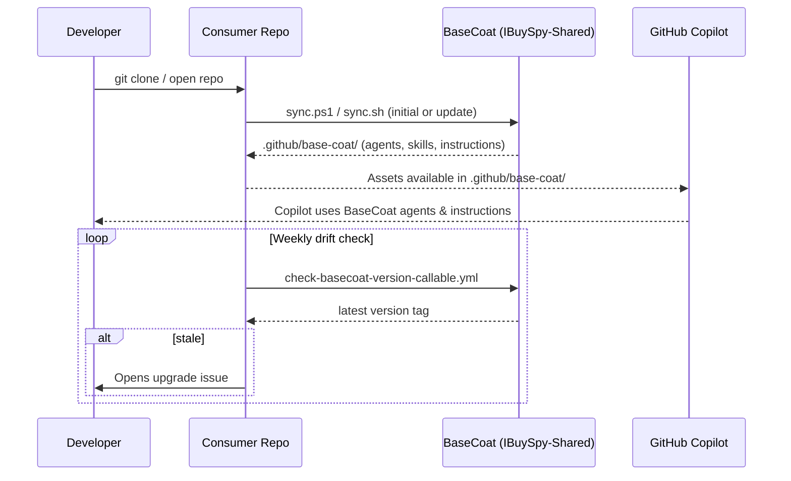
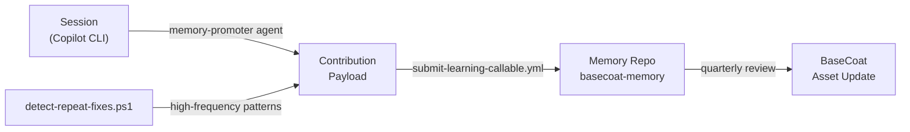

# Architecture Overview

BaseCoat is a **distributed Copilot customization library** — assets are authored centrally
and synced into consumer repositories, where GitHub Copilot picks them up automatically.

## System Context



## Asset Taxonomy

BaseCoat assets are organized into four types, each with a specific role in shaping Copilot's behavior:

| Type | Count | Role | Location |
|---|---|---|---|
| **Agents** | 79 | End-to-end task executors with defined inputs, workflow, and output | `agents/*.agent.md` |
| **Skills** | 57 | Reusable domain capabilities invoked by agents | `skills/*/SKILL.md` |
| **Instructions** | 64 | Copilot behavior rules applied by file path pattern | `instructions/*.instructions.md` |
| **Prompts** | 3 | Structured templates for repeatable tasks | `prompts/*.prompt.md` |



## Consumer Sync Lifecycle



## Memory Contribution Flow

Patterns discovered in sessions can be promoted to long-term BaseCoat memory via the
memory-promoter agent:



## Key Design Decisions

- **[ADR-001 — Naming Convention](decisions/adr-001-naming-convention.md)**: Why `basecoat`
  (repo) and `base-coat` (artifact) coexist
- **Distributed sync model**: Assets live in consumer repos — no runtime dependency on BaseCoat
- **Quality gate**: CI blocks merges if avg asset score < 5.0/10 or any asset scores 0
- **Idempotent drift detection**: Version check workflow updates existing issues rather than
  opening duplicates

## Repository Structure

```text
basecoat/
├── agents/          # 79 agent definition files
├── skills/          # 57 skill directories
├── instructions/    # 64 instruction files
├── prompts/         # 3 prompt templates
├── scripts/         # Sync, audit, coherence, adoption scripts
├── tests/           # Validation and quality gate tests
├── docs/            # This documentation
├── mcp/             # MCP server exposing metrics to AI agents
└── .github/
    └── workflows/   # CI, release, deploy, drift detection
```
