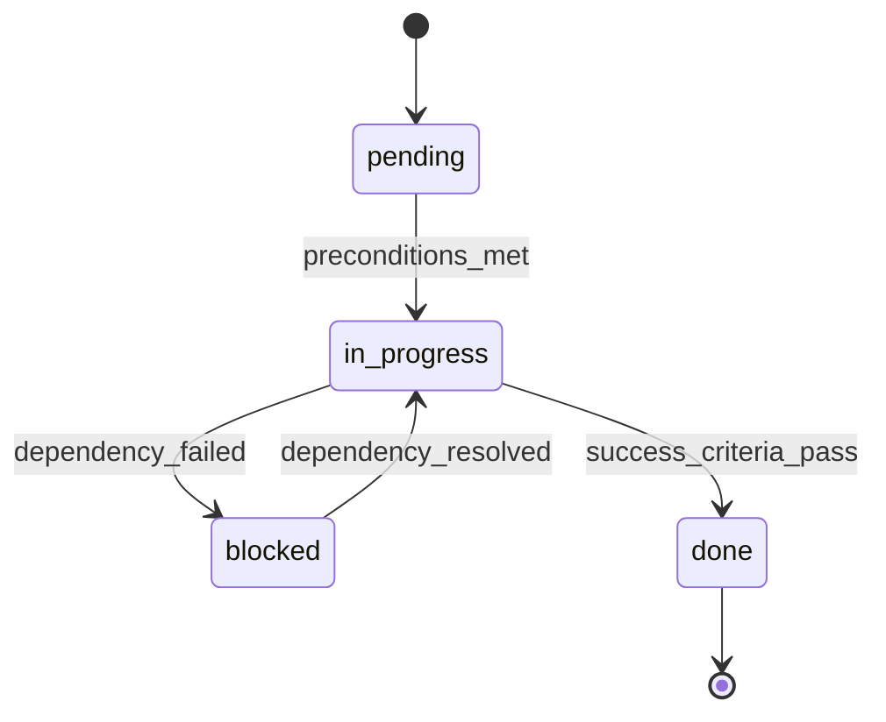

# Agent Planning Patterns

This design captures lightweight planning patterns that improve agent execution
without turning BaseCoat into a heavyweight planner runtime.

## Goal

Make planning paths explicit and verifiable by adding:

- goal-state targeting
- precondition and transition checks
- testable completion criteria
- dependency-safe handoffs

## Framework assessment

| Pattern | Keep | How it applies in BaseCoat |
|---|---|---|
| GOAP | Yes (lite) | Model tasks as actions with preconditions, effects, and cost for re-planning. |
| State machine (FSM) | Yes | Constrain execution to valid states and transitions. |
| TDD contracts | Yes | Define success criteria before execution and verify after each major step. |
| Promise contracts | Yes | Make inter-agent dependencies explicit (`pending -> fulfilled/rejected`). |
| API-first | Yes | Add typed input/output contract fields to planning artifacts. |
| GOAT heuristic | Partial | Use as a quality pass before execution, not as a mandatory planning layer. |
| OODA / pre-mortem / critical path | Yes | Use as planning checks in issue decomposition and wave assignment. |

## Planning contract (minimal)

Use these optional fields in agent templates and planning outputs.

```yaml
goal_state:
  description: "All acceptance criteria met; tests green; PR opened"
  done_when:
    - "tests_pass == true"
    - "pr_url != null"

preconditions:
  - "issue_exists == true"
  - "branch_created == true"

success_criteria:
  - id: tests-pass
    check: "tests/run-tests.ps1 exits 0"
  - id: pr-open
    check: "GitHub PR exists for working branch"

state_model:
  initial: pending
  terminal: [done, blocked]
  transitions:
    - from: pending
      to: in_progress
      guard: "all preconditions met"
    - from: in_progress
      to: blocked
      guard: "hard dependency unresolved"
    - from: in_progress
      to: done
      guard: "all success_criteria passed"
```

## PDDL-lite action shape

For planning agents, represent actions in a small schema:

```yaml
actions:
  - id: run-tests
    cost: 2
    preconditions: ["code_changed == true"]
    effects: ["tests_pass == true"]
  - id: open-pr
    cost: 1
    preconditions: ["tests_pass == true", "branch_pushed == true"]
    effects: ["pr_open == true"]
```

This keeps GOAP benefits (re-planning and effect validation) without requiring
full PDDL tooling.

## State machine artifact requirement

Planning agents should emit a Mermaid state diagram when workflow has more than
three states or has retry/block branches.



## SQL todo schema recommendation

Add `success_criteria` to the `todos` table as JSON text.

```sql
ALTER TABLE todos ADD COLUMN success_criteria TEXT;
```

Suggested JSON shape:

```json
[
  { "id": "tests-pass", "check": "tests/run-tests.ps1 exits 0" },
  { "id": "pr-open", "check": "PR exists for branch" }
]
```

This enables TDD-style stop conditions for agent loops.

## First agents to adopt explicit state behavior

1. `agents/sprint-planner.agent.md` (goal decomposition and dependency transitions)
2. `agents/issue-triage.agent.md` (classification states and SLA escalation guards)
3. `agents/merge-coordinator.agent.md` (merge attempt/retry/escalation transitions)

## Rollout

1. Update agent template with optional `goal_state`, `preconditions`, and `success_criteria`.
2. Apply contract fields to `sprint-planner`, `issue-triage`, and `merge-coordinator`.
3. Add validation checks to planning outputs (criteria pass/fail summary).
4. Expand to other agents only after proving reduced rework and fewer blocked loops.
