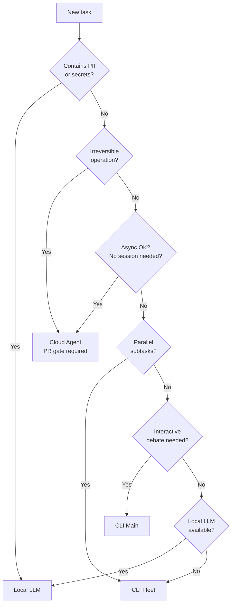

# Agent-Tier Selection Guide

Choosing the right agent tier for each task reduces cost, protects sensitive data,
and prevents session instability. This guide explains the four tiers available in
BaseCoat workflows, when to use each, and how to configure team defaults.

## Why Agent-Tier Selection Matters

| Dimension | Impact if wrong tier chosen |
|---|---|
| **Cost** | Running long tasks in CLI Main burns premium Opus tokens unnecessarily |
| **Security** | Sending PII to cloud agents creates a data-egress compliance violation |
| **Latency** | Routing interactive tasks to the Cloud Agent stalls work for hours |
| **Reliability** | Dispatching 10+ fleet agents simultaneously hits enterprise rate limits |

Explicit tier selection removes these failure modes before a task starts.

## The Four Tiers

### Cloud Agent (Copilot Coding Agent)

Triggered by posting `/approve` on a GitHub issue. Runs asynchronously in a cloud
workspace with full repository access. Always produces a pull request — a human
must merge it.

| Attribute | Detail |
|---|---|
| Invocation | GitHub issue comment: `/approve` |
| Scope | Async, repo-scoped, no open session required |
| Strengths | Long tasks, compliance scans, PR gate enforcement, no session timeout |
| Limitations | Not interactive; cannot respond to real-time feedback |
| Required for | Irreversible operations (force push, bulk delete, production deploy) |

### CLI Fleet (Background Agents)

Parallel sub-agents launched from the main conversation via the `task` tool. Each
agent is stateless and receives all needed context in its dispatch prompt.

| Attribute | Detail |
|---|---|
| Invocation | `task(agent_type: "...", model: "...", prompt: "...")` |
| Scope | Session-parallel; up to 5 concurrent agents |
| Strengths | Independent subtask fan-out, sprint execution, phase-gated workflows |
| Limitations | Hard cap of 5 concurrent (enterprise 429 risk above this); no inter-agent coordination |
| Required for | Sprint phases where subtasks are independent and bounded |

### CLI Main Conversation

The primary interactive surface. High-reasoning, human-in-the-loop, and able to
orchestrate fleet agents and interpret their results.

| Attribute | Detail |
|---|---|
| Invocation | Direct interaction in the terminal |
| Scope | Single session; interactive |
| Strengths | Ambiguity resolution, design debates, iterative debugging, orchestration |
| Limitations | Session timeout risk after ~15 min inactivity; premium token cost at scale |
| Required for | Tasks needing judgment, real-time feedback, or multi-turn refinement |

### Local LLM (Ollama / LM Studio)

Runs fully on-device with zero data egress. Mandatory for any input that contains
PII, credentials, or data governed by compliance or data-residency policy.

| Attribute | Detail |
|---|---|
| Invocation | Local runtime (Ollama, LM Studio, etc.) |
| Scope | On-device only; no network calls |
| Strengths | Zero data egress, compliance-safe, air-gap compatible |
| Limitations | Lower reasoning capability; limited tool access |
| Required for | PII, secrets, regulated data, air-gapped environments |

## Decision Flowchart



## Configurable Defaults Schema

Teams can provide a `.github/base-coat/agent-routing.json` file to override soft
defaults. The schema has three sections:

```json
{
  "enforced": {
    "pii_or_secrets": "local-llm",
    "irreversible_operations": "cloud-agent",
    "regulated_environment": "local-llm"
  },
  "configurable": {
    "default_fleet_concurrency": 5,
    "cli_main_timeout_minutes": 15,
    "prefer_local_for_low_stakes": true
  },
  "guidelines": {
    "security_audit": "cloud-agent",
    "parallel_subtasks": "cli-fleet",
    "interactive_planning": "cli-main",
    "long_async_task": "cloud-agent",
    "high_frequency_edits": "local-llm",
    "sprint_execution": "cli-fleet",
    "pr_review": "cloud-agent",
    "iterative_debugging": "cli-main"
  }
}
```

**Section rules:**

- `enforced` — never override these via config. Violations are a compliance issue.
- `configurable` — adjust to match your team's runner capacity and cost budget.
- `guidelines` — soft defaults; individual tasks may deviate with justification.

## Routing Decision Matrix (Quick Reference)

| Signal | Default Tier |
|--------|-------------|
| Security audit / compliance scan | Cloud Agent |
| Parallel independent subtasks (≤5) | CLI Fleet |
| Interactive design debate / planning | CLI Main |
| Long async task, no session dependency | Cloud Agent |
| High-frequency, low-stakes edits | Local LLM |
| Sprint execution with phase dependencies | CLI Fleet |
| PR review / code analysis | Cloud Agent |
| Iterative debugging with immediate feedback | CLI Main |

## Anti-Patterns

| Anti-Pattern | Risk | Fix |
|---|---|---|
| 7+ concurrent fleet agents | Enterprise 429 rate limit | Cap at 5; queue the rest |
| PII or proprietary code sent to cloud agents | Data-egress violation | Route to Local LLM |
| CLI Main for tasks lasting > 15 minutes | Session timeout, lost progress | Delegate to Cloud Agent or Fleet |
| Cloud Agent for interactive back-and-forth | Agent is async; cannot respond | Use CLI Main |
| No PR gate for irreversible operations | Unreviewed destructive change | Enforce PR gate via Cloud Agent |

## Related Guidance

- [Agent Routing Instructions](https://github.com/IBuySpy-Shared/basecoat/blob/main/instructions/agent-routing.instructions.md) — machine-readable routing rules for Copilot
- [Model Routing](https://github.com/IBuySpy-Shared/basecoat/blob/main/instructions/model-routing.instructions.md) — which LLM tier (Opus / Sonnet / Haiku) within a tier
- [Runner Routing](../reference/guardrails/runner-routing.md) — which CI runner for GitHub Actions jobs
- [Context Routing](https://github.com/IBuySpy-Shared/basecoat/blob/main/instructions/references/token-economics/context-routing.md) — which context tiers to load
