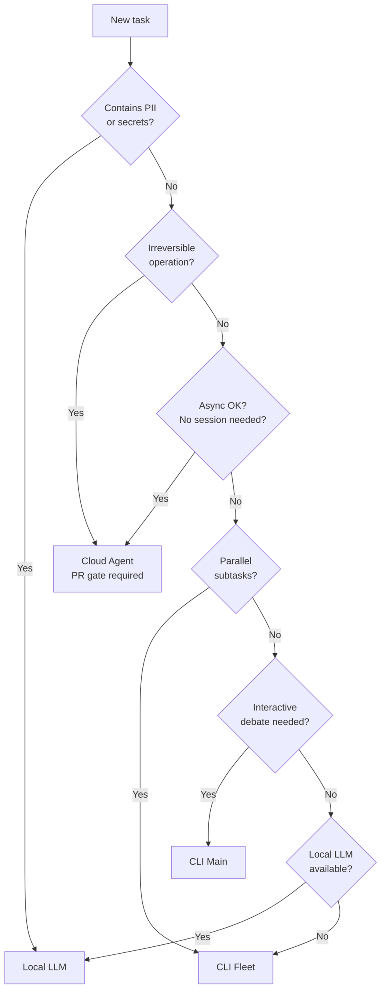

# Agent-Tier Selection Guide

Choosing the right agent tier for each task reduces cost, protects sensitive data,
and prevents session instability. This guide explains the four tiers available in
BaseCoat workflows, when to use each, and how to configure team defaults.

## Why Agent-Tier Selection Matters

| Dimension | Impact if wrong tier chosen |
|---|---|
| **Cost** | Running long tasks in CLI Main burns premium Opus tokens unnecessarily |
| **Security** | Sending PII to cloud agents creates a data-egress compliance violation |
| **Latency** | Routing interactive tasks to the Cloud Agent stalls work for hours |
| **Reliability** | Dispatching 10+ fleet agents simultaneously hits enterprise rate limits |

Explicit tier selection removes these failure modes before a task starts.

## The Four Tiers

### Cloud Agent (Copilot Coding Agent)

Triggered by posting `/approve` on a GitHub issue. Runs asynchronously in a cloud
workspace with full repository access. Always produces a pull request ΓÇö a human
must merge it.

| Attribute | Detail |
|---|---|
| Invocation | GitHub issue comment: `/approve` |
| Scope | Async, repo-scoped, no open session required |
| Strengths | Long tasks, compliance scans, PR gate enforcement, no session timeout |
| Limitations | Not interactive; cannot respond to real-time feedback |
| Required for | Irreversible operations (force push, bulk delete, production deploy) |

### CLI Fleet (Background Agents)

Parallel sub-agents launched from the main conversation via the `task` tool. Each
agent is stateless and receives all needed context in its dispatch prompt.

| Attribute | Detail |
|---|---|
| Invocation | `task(agent_type: "...", model: "...", prompt: "...")` |
| Scope | Session-parallel; 2–3 concurrent general-purpose agents (enterprise quota limit) |
| Strengths | Independent subtask fan-out, sprint execution, phase-gated workflows |
| Limitations | Hard ceiling of ``max_fleet_agents`` (default: 4); no inter-agent coordination |
| Required for | Sprint phases where subtasks are independent and bounded |

### CLI Main Conversation

The primary interactive surface. High-reasoning, human-in-the-loop, and able to
orchestrate fleet agents and interpret their results.

| Attribute | Detail |
|---|---|
| Invocation | Direct interaction in the terminal |
| Scope | Single session; interactive |
| Strengths | Ambiguity resolution, design debates, iterative debugging, orchestration |
| Limitations | Session timeout risk after ~15 min inactivity; premium token cost at scale |
| Required for | Tasks needing judgment, real-time feedback, or multi-turn refinement |

### Local LLM (Ollama / LM Studio)

Runs fully on-device with zero data egress. Mandatory for any input that contains
PII, credentials, or data governed by compliance or data-residency policy.

| Attribute | Detail |
|---|---|
| Invocation | Local runtime (Ollama, LM Studio, etc.) |
| Scope | On-device only; no network calls |
| Strengths | Zero data egress, compliance-safe, air-gap compatible |
| Limitations | Lower reasoning capability; limited tool access |
| Required for | PII, secrets, regulated data, air-gapped environments |

## Decision Flowchart



## Fleet Parallelism

Each background general-purpose agent consumes model API capacity for its entire lifetime.
Running too many simultaneously saturates the enterprise quota and triggers HTTP 429
`user_global_rate_limited` errors across the whole session.

### Why Wave Batching

Seven agents running for 10–15 minutes each is equivalent to 70–105 agent-minutes of
sustained model capacity drawn in parallel. Enterprise quotas are measured per-user across
all concurrent sessions, so the combined draw causes the rate limiter to reject new requests
mid-session. Wave batching caps the simultaneous draw to a predictable, safe level.

### Wave Dispatch Pattern

Dispatch work in waves of 2–4 agents. Wait for the entire wave to complete before
launching the next:

| Wave | Agents dispatched | Gate before next wave |
|------|------------------|-----------------------|
| 1 | Tasks 1–4 | Wait for all 4 to finish |
| 2 | Tasks 5–8 | Wait for all 4 to finish |
| 3 | Tasks 9–12 | Wait for all 4 to finish |

**Example — 12-task sprint broken into 3 waves:**

```text
Wave 1: implement auth module, add unit tests, update README, lint-fix CI config
Wave 2: implement API routes, add integration tests, update OpenAPI spec, bump version
Wave 3: write migration script, update docs, close tracking issues, open final PR
```

Use the Haiku / fast model for short-lived tasks (file edits, lint fixes, PR merges) to
reduce token burn and quota pressure within each wave.

### Long-Running Agent Rules

Agents expected to run longer than 5 minutes (deploys, workflow triggers, large builds)
should be dispatched **alone or in pairs**, never bundled into a wave with other agents.

### 429 Recovery Pattern

If a `user_global_rate_limited` (HTTP 429) error is returned:

1. **Wait 60 seconds** — do not retry immediately.
2. **Retry only the failed agent(s)** — do not re-dispatch the entire wave.
3. **Reduce wave size** for subsequent waves if 429 errors recur.

Re-dispatching all agents simultaneously after a rate limit makes the problem worse.

### Configuration

The `max_fleet_agents` key in `.github/base-coat/agent-routing.json` sets the per-session
fleet ceiling (default: 4). Adjust downward if your enterprise plan has a stricter quota:

```json
"configurable": {
  "default_fleet_concurrency": 3,
  "max_fleet_agents": 4
}
```

## Configurable Defaults Schema

Teams can provide a `.github/base-coat/agent-routing.json` file to override soft
defaults. The schema has three sections:

```json
{
  "enforced": {
    "pii_or_secrets": "local-llm",
    "irreversible_operations": "cloud-agent",
    "regulated_environment": "local-llm"
  },
  "configurable": {
    "default_fleet_concurrency": 5,
    "cli_main_timeout_minutes": 15,
    "prefer_local_for_low_stakes": true
  },
  "guidelines": {
    "security_audit": "cloud-agent",
    "parallel_subtasks": "cli-fleet",
    "interactive_planning": "cli-main",
    "long_async_task": "cloud-agent",
    "high_frequency_edits": "local-llm",
    "sprint_execution": "cli-fleet",
    "pr_review": "cloud-agent",
    "iterative_debugging": "cli-main"
  }
}
```

**Section rules:**

- `enforced` ΓÇö never override these via config. Violations are a compliance issue.
- `configurable` ΓÇö adjust to match your team's runner capacity and cost budget.
- `guidelines` ΓÇö soft defaults; individual tasks may deviate with justification.

## Routing Decision Matrix (Quick Reference)

| Signal | Default Tier |
|--------|-------------|
| Security audit / compliance scan | Cloud Agent |
| Parallel independent subtasks (Γëñ5) | CLI Fleet |
| Interactive design debate / planning | CLI Main |
| Long async task, no session dependency | Cloud Agent |
| High-frequency, low-stakes edits | Local LLM |
| Sprint execution with phase dependencies | CLI Fleet |
| PR review / code analysis | Cloud Agent |
| Iterative debugging with immediate feedback | CLI Main |

## Anti-Patterns

| Anti-Pattern | Risk | Fix |
|---|---|---|
| 4+ concurrent fleet agents | Enterprise 429 rate limit | Cap at 2–3; use wave batching |
| PII or proprietary code sent to cloud agents | Data-egress violation | Route to Local LLM |
| CLI Main for tasks lasting > 15 minutes | Session timeout, lost progress | Delegate to Cloud Agent or Fleet |
| Cloud Agent for interactive back-and-forth | Agent is async; cannot respond | Use CLI Main |
| No PR gate for irreversible operations | Unreviewed destructive change | Enforce PR gate via Cloud Agent |

## Related Guidance

- [Agent Routing Instructions](../../instructions/agent-routing.instructions.md) ΓÇö machine-readable routing rules for Copilot
- [Model Routing](../../instructions/model-routing.instructions.md) ΓÇö which LLM tier (Opus / Sonnet / Haiku) within a tier
- [Runner Routing](../reference/guardrails/runner-routing.md) ΓÇö which CI runner for GitHub Actions jobs
- [Context Routing](../../instructions/references/token-economics/context-routing.md) ΓÇö which context tiers to load
