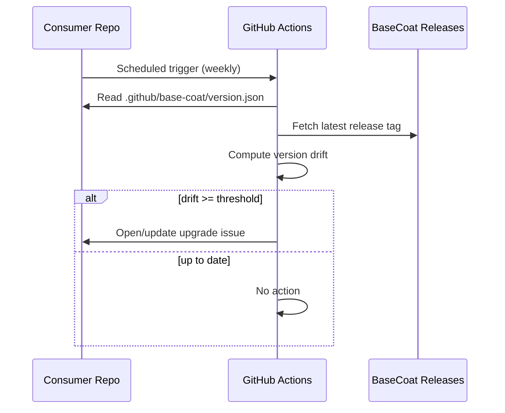

# Version Drift Detection

BaseCoat provides a callable workflow that consumer repos can schedule to detect when their synced assets are out of date.

## How it works



## Setup

Copy this to `.github/workflows/check-basecoat-version.yml` in your consumer repo:

```yaml
name: Check BaseCoat Version
on:
  schedule:
    - cron: '0 9 * * 1'
  workflow_dispatch:
jobs:
  check:
    uses: IBuySpy-Shared/basecoat/.github/workflows/check-basecoat-version-callable.yml@main
    with:
      stage_path: .github/base-coat
      alert_threshold: 1
    permissions:
      issues: write
      contents: read
```

## Inputs

| Input | Default | Description |
|---|---|---|
| `stage_path` | `.github/base-coat` | Path to synced BaseCoat assets |
| `alert_threshold` | `1` | Versions behind before alerting |

## What the issue looks like

When drift is detected, an issue is opened in the consumer repo titled:

> `chore: BaseCoat upgrade available (v3.23.0 → v3.25.0)`

The issue includes the current version, latest version, and upgrade instructions. If the issue already exists, a comment is added instead (idempotent).
