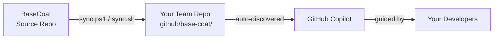

# BaseCoat

**Enterprise-grade GitHub Copilot customization framework.**

BaseCoat gives your organization a curated, version-controlled library of agents, skills, instructions, and prompts — synced into every team repo with a single command. Instead of every team writing Copilot customizations from scratch, you get production-ready assets that enforce consistent standards across your entire GitHub Enterprise org.

- [README.md](https://github.com/IBuySpy-Shared/basecoat/blob/main/README.md) — Getting started, installation, and overview
- [CHANGELOG.md](https://github.com/IBuySpy-Shared/basecoat/blob/main/CHANGELOG.md) — Release history
- [CONTRIBUTING.md](https://github.com/IBuySpy-Shared/basecoat/blob/main/CONTRIBUTING.md) — Contribution guide
- [PHILOSOPHY.md](PHILOSOPHY.md) — Design philosophy and principles

---

## What's in the box

| Asset type | Count | What it does |
|---|---|---|
| **Agents** | 79 | End-to-end task executors — sprint planners, code reviewers, security analysts, and more |
| **Skills** | 57 | Reusable domain capabilities invoked by agents |
| **Instructions** | 64 | Copilot behavior rules scoped by file path pattern |
| **Prompts** | 3 | Structured templates for repeatable tasks |

---

## How it works

1. **Sync** — run one script to pull the latest BaseCoat release into `.github/base-coat/`
2. **Use** — Copilot auto-discovers agents, instructions, and prompts from `.github/`
3. **Contribute** — open a PR to share patterns back with every team in the org

---

## Explore the docs

- [integrations/mcp-deployment.md](integrations/mcp-deployment.md) — Deploying the Base Coat MCP server
- [integrations/pydantic-mcp-integration.md](integrations/pydantic-mcp-integration.md) — Pydantic + MCP integration
- [integrations/pydantic-typescript-client-generation.md](integrations/pydantic-typescript-client-generation.md) — TypeScript client generation
- [integrations/AZURE_AD_INTEGRATION_GUIDE.md](integrations/AZURE_AD_INTEGRATION_GUIDE.md) — Azure AD integration
- [integrations/AZURE_SQL_MIGRATION_GUIDANCE.md](integrations/AZURE_SQL_MIGRATION_GUIDANCE.md) — Azure SQL migration
- [integrations/ENTERPRISE_IDENTITY_ACCESS.md](integrations/ENTERPRISE_IDENTITY_ACCESS.md) — Identity & access patterns
- [integrations/ENTERPRISE_KUBERNETES_PATTERNS.md](integrations/ENTERPRISE_KUBERNETES_PATTERNS.md) — AKS / K8s guidance
- [integrations/APPLICATION_GATEWAY_ROUTING_GUIDANCE.md](integrations/APPLICATION_GATEWAY_ROUTING_GUIDANCE.md) — App Gateway routing
- [integrations/RBAC_ONLY_AUTHENTICATION_PATTERNS.md](integrations/RBAC_ONLY_AUTHENTICATION_PATTERNS.md) — RBAC auth patterns
- [integrations/untools-integration.md](integrations/untools-integration.md) — UnTools integration guide

## Reference (`docs/reference/`)

- [reference/INVENTORY.md](reference/INVENTORY.md) — Full asset listing (agents, skills, instructions, prompts)
- [reference/GOVERNANCE.md](reference/GOVERNANCE.md) — Contribution policies and review standards
- [reference/DISTRIBUTION.md](reference/DISTRIBUTION.md) — Sync mechanism for consumer repos
- [reference/HOOKS.md](reference/HOOKS.md) — Git hooks and pre-commit validation
- [reference/GOALS.md](reference/GOALS.md) — Project goals and OKRs
- [reference/SCOPED_INSTRUCTIONS.md](reference/SCOPED_INSTRUCTIONS.md) — Scoped instruction authoring guide
- [reference/LABEL_TAXONOMY.md](reference/LABEL_TAXONOMY.md) — GitHub label taxonomy
- [reference/PROMPT_REGISTRY.md](reference/PROMPT_REGISTRY.md) — Prompt catalog and registry
- [reference/ASSET_REGISTRY.md](reference/ASSET_REGISTRY.md) — Asset registry metadata
- [reference/CLI_COMMAND_REFERENCE.md](reference/CLI_COMMAND_REFERENCE.md) — CLI command reference
- [reference/COMPONENT_LIBRARY.md](reference/COMPONENT_LIBRARY.md) — Component library reference
- [reference/PRODUCT.md](reference/PRODUCT.md) — Product vision and roadmap
- [reference/QUICK_REFERENCE.md](reference/QUICK_REFERENCE.md) — Quick reference card
- [reference/treatment-matrix.md](reference/treatment-matrix.md) — Issue treatment matrix
- [reference/guardrails/](reference/guardrails/) — Guardrail configuration files

## Operations (`docs/operations/`)

- [operations/RELEASE_PROCESS.md](operations/RELEASE_PROCESS.md) — How releases are cut and published
- [operations/RELEASE_METRICS.md](operations/RELEASE_METRICS.md) — Release metrics and KPIs
- [operations/OPERATIONAL_RUNBOOK.md](operations/OPERATIONAL_RUNBOOK.md) — Runbook for common operations
- [operations/DISASTER_RECOVERY.md](operations/DISASTER_RECOVERY.md) — DR procedures
- [operations/COST_OPTIMIZATION.md](operations/COST_OPTIMIZATION.md) — Cost analysis and optimization
- [operations/ENTERPRISE_RUNNERS.md](operations/ENTERPRISE_RUNNERS.md) — Self-hosted runner setup
- [operations/ENTERPRISE_SECURITY_HARDENING.md](operations/ENTERPRISE_SECURITY_HARDENING.md) — Security hardening guide
- [operations/BLOCKED_ISSUES.md](operations/BLOCKED_ISSUES.md) — Blocked issues tracking
- [operations/TELEMETRY_ADOPTION.md](operations/TELEMETRY_ADOPTION.md) — Adoption telemetry guide
- [operations/GITHUB_SECRETS.md](operations/GITHUB_SECRETS.md) — Repository secrets setup and rotation guide
- [operations/security/](operations/security/) — Security policies and audit docs

## Templates (`docs/templates/`)

- [templates/](templates/) — Reusable file and directory templates (shared memory, repo scaffold, etc.)

## Archive

> Historical Wave 3 staging deliverables, portal design docs, wireframes, and cleanup reports.
> These are preserved for reference but are not part of the active framework.

- [View archive on GitHub](https://github.com/IBuySpy-Shared/basecoat/tree/main/docs/archive) — All archived Wave 3, portal, design, and audit documents
