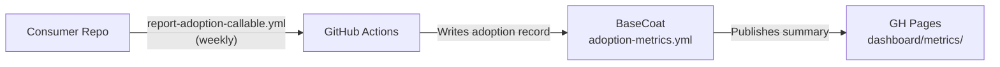

# Adoption Metrics

Live weekly snapshot of BaseCoat adoption across consumer repositories — asset
coverage, version currency, and onboarding trends.

[Open Dashboard :material-open-in-new:](https://ibuyspy-shared.github.io/basecoat/dashboard/metrics/){ .md-button .md-button--primary target=_blank }

---

## What the dashboard tracks

| Metric | Description |
|---|---|
| **Consumer count** | Repositories that have adopted the BaseCoat overlay |
| **Version currency** | % of consumers on the latest release vs. drifted |
| **Asset coverage** | Which asset types (agents / skills / instructions / prompts) each consumer has synced |
| **Onboarding rate** | New consumers added per sprint |
| **Drift alerts** | Consumers more than one minor version behind |

## How metrics are collected

The `adoption-metrics.yml` workflow runs weekly and inspects the `gh-pages` branch
for consumer-reported sync state. It does **not** access private repositories —
consumers report adoption by triggering the `report-adoption-callable.yml` workflow
in their own repos, which writes an anonymised record to BaseCoat's metrics store.



## Data retention

Metrics snapshots are stored in the `gh-pages` branch under `dashboard/metrics/`.
Each weekly run appends a JSON record. The dashboard retains 52 weeks of history.

## Enabling adoption reporting in your repo

Add the following workflow call to your consumer repository to participate in
adoption metrics. This is opt-in and anonymous — no private code or data is shared.

```yaml
# .github/workflows/report-adoption.yml
name: Report BaseCoat Adoption
on:
  schedule:
    - cron: '0 6 * * 1'   # Monday 06:00 UTC
  workflow_dispatch:

jobs:
  report:
    uses: IBuySpy-Shared/basecoat/.github/workflows/report-adoption-callable.yml@main
    with:
      basecoat_version: ${{ vars.BASECOAT_VERSION }}
```

!!! tip "Version variable"
    Set the `BASECOAT_VERSION` repository variable to the BaseCoat version you have
    installed (found in `.github/base-coat/version.json`). The sync workflow updates
    this automatically when you run `sync.ps1`.
