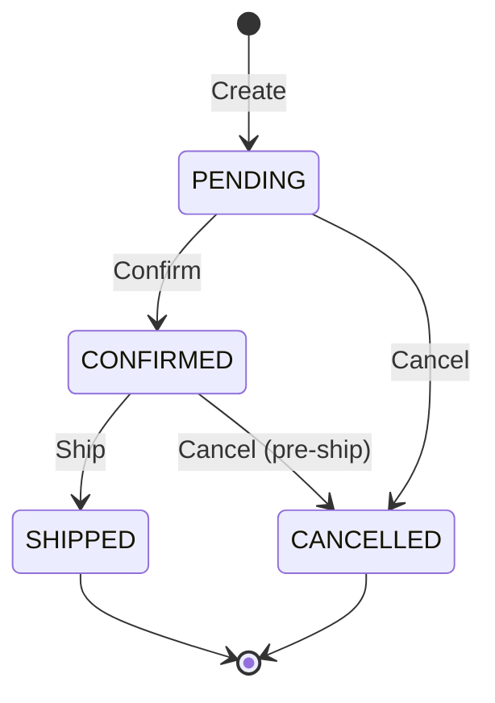

# Aggregate Design — [Aggregate Root Name]

> Replace all bracketed placeholders with project-specific content.

## Overview

| Field | Value |
|---|---|
| **Bounded Context** | [Context name] |
| **Aggregate Root** | [Root entity name — e.g., Order] |
| **Team owner** | [Team name] |
| **Status** | [Draft / Reviewed / Approved] |
| **Date** | [YYYY-MM-DD] |

---

## Purpose

[One to two sentences describing what this aggregate represents in the domain and why it exists as a single consistency boundary.]

---

## Aggregate Members

### Aggregate Root

| Field | Type | Required | Description |
|---|---|---|---|
| `id` | [UUID / string] | Yes | Globally unique identifier |
| `[field]` | [type] | [Yes/No] | [description] |

### Entities

> Entities have identity and a lifecycle. They can change over time.

#### [Entity Name]

| Field | Type | Required | Description |
|---|---|---|---|
| `id` | [UUID / string] | Yes | Unique within the aggregate |
| `[field]` | [type] | [Yes/No] | [description] |

### Value Objects

> Value objects have no identity. Two instances with the same attributes are equal. They are immutable.

#### [ValueObject Name]

| Field | Type | Description |
|---|---|---|
| `[field]` | [type] | [description] |

**Equality rule:** [Describe what makes two instances equal — e.g., "Two Money objects are equal if amount and currency match."]

---

## Invariants

> Invariants are business rules that must always be true within the aggregate. The aggregate root is responsible for enforcing them.

| # | Invariant | Enforced By | Error Condition |
|---|---|---|---|
| 1 | [e.g., Order total must equal sum of line item prices] | `[MethodName]()` | Throws `[ExceptionType]` |
| 2 | [e.g., A shipped order cannot be modified] | `AddItem()` | Throws `InvalidOperationException` |
| 3 | [Add more rows as needed] | | |

---

## Commands

> Commands represent intent to change state. They are handled by the aggregate root.

| Command | Handler Method | Pre-conditions | Post-conditions | Domain Events Raised |
|---|---|---|---|---|
| `[CreateOrder]` | `Create()` | Order does not exist | Order is in PENDING state | `OrderCreated` |
| `[AddItem]` | `AddItem(item)` | Order is not SHIPPED | Item added to order lines; total recalculated | `ItemAdded` |
| `[ConfirmOrder]` | `Confirm()` | At least one item; payment reserved | Order is in CONFIRMED state | `OrderConfirmed` |

---

## Domain Events

> Domain events record that something significant happened. They are raised by the aggregate and consumed by other aggregates or contexts.

| Event | Raised By | Payload Fields | Consumers |
|---|---|---|---|
| `OrderCreated` | `Create()` | orderId, customerId, timestamp | Notification context, Inventory context |
| `ItemAdded` | `AddItem()` | orderId, itemId, quantity, price | — |
| `OrderConfirmed` | `Confirm()` | orderId, totalPrice, timestamp | Payment context, Fulfillment context |

---

## Lifecycle State Machine

> Adjust states and transitions to match the aggregate's actual lifecycle.

---

## Design Notes

- **Why is [Entity X] inside this aggregate?** [Justification — e.g., "OrderLine must be inside Order because its price is part of the Order's total invariant."]
- **Why is [Entity Y] a separate aggregate?** [Justification — e.g., "Customer is referenced by identity only because it has its own lifecycle and invariants."]
- **Snapshot strategy:** [Describe if snapshots are used to avoid replaying a long event stream — e.g., "Snapshot every 50 events stored in snapshots table."]

---

## Cross-Aggregate References

> Only reference other aggregates by identity. Never hold a direct object reference.

| Referenced Aggregate | Reference Type | How Used |
|---|---|---|
| `Customer` | `customerId: UUID` | Owner of the order; looked up by application service when needed |
| `Product` | `productId: UUID` | Validated at item addition; price captured at time of order |

---

## Revision History

| Date | Author | Change |
|---|---|---|
| [YYYY-MM-DD] | [Name] | Initial draft |
