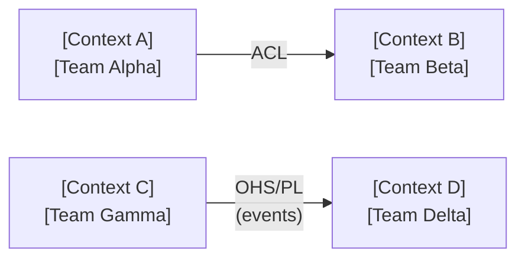

# Bounded Context Map — [System or Domain Name]

> Replace all bracketed placeholders with project-specific content.

## System Overview

**Domain:** [Core domain name]
**Date:** [YYYY-MM-DD]
**Author(s):** [Names or team]

## Bounded Contexts

<!-- Repeat this block for each bounded context -->

### [Context Name]

| Field | Value |
|---|---|
| **Team owner** | [Team name] |
| **Subdomain type** | [Core / Supporting / Generic] |
| **Ubiquitous language summary** | [One-sentence language scope — e.g., "Here 'Order' means a confirmed purchase. An 'Item' is a line in that order."] |
| **Key aggregates** | [Comma-separated list — e.g., Order, Customer] |
| **Key domain events published** | [Comma-separated list — e.g., OrderPlaced, PaymentConfirmed] |
| **Persistence** | [e.g., PostgreSQL orders_db, event store] |
| **Deployment unit** | [e.g., order-service, monolith module] |

---

## Context Relationships

<!-- One row per integration pair. Add or remove rows as needed. -->

| Upstream Context | Downstream Context | Pattern | Integration Mechanism | Notes |
|---|---|---|---|---|
| [Context A] | [Context B] | Anti-Corruption Layer | REST/Adapter | [Context B] wraps [Context A] model to protect domain integrity |
| [Context C] | [Context D] | Open Host Service / Published Language | Event (Kafka topic `orders.v1`) | Versioned Avro schema; additive changes only |
| [Context E] | [Context F] | Customer/Supplier | gRPC contract | [Context F] team raises change requests to [Context E] |
| [Context G] | [Context H] | Conformist | Direct DB read replica | Legacy dependency; no leverage to negotiate |

### Pattern Reference

| Pattern | Symbol | When to Use |
|---|---|---|
| Anti-Corruption Layer | ACL | Downstream must isolate itself from a poorly fitting upstream model |
| Open Host Service | OHS | Upstream publishes a stable API consumed by many downstream contexts |
| Published Language | PL | Shared schema or event format defined independently of either model |
| Customer/Supplier | C/S | Teams have a negotiated contract; upstream respects downstream needs |
| Conformist | CF | Downstream adopts upstream model as-is |
| Partnership | PP | Two contexts co-evolve; teams deploy together |
| Separate Ways | SW | Contexts are intentionally decoupled; duplication is acceptable |

---

## Context Map Diagram

> Adjust node names and edge labels to match the relationship table above.
> Use `ACL`, `OHS/PL`, `C/S`, `CF`, `PP`, or `SW` as edge labels.

---

## Open Issues and Risks

| # | Context(s) | Issue | Severity | Owner | Due |
|---|---|---|---|---|---|
| 1 | [Context A] | Missing ACL — downstream consuming raw upstream model | High | [Team Beta] | [Date] |
| 2 | [Context C, D] | Shared database — contexts not fully decoupled | Medium | [Architect] | [Date] |

---

## Revision History

| Date | Author | Change |
|---|---|---|
| [YYYY-MM-DD] | [Name] | Initial draft |
